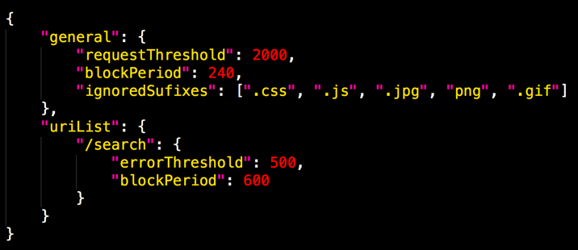
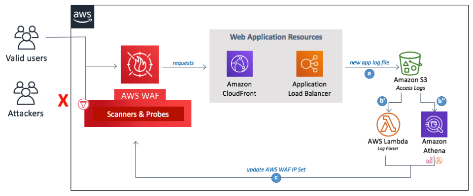
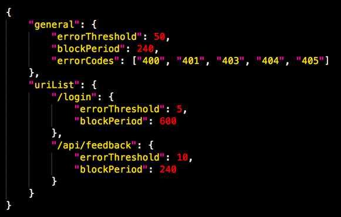
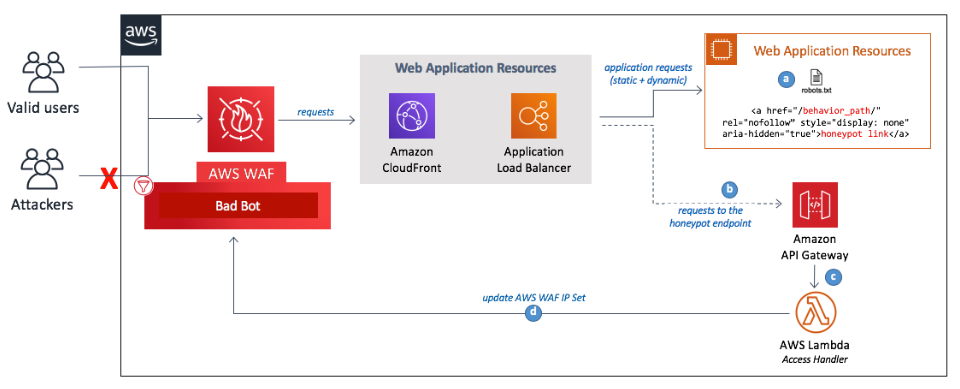

# Overview
AWS WAF Security Automations에 대해

# AWS WAF
AWS WAF is a web application firewall that helps protect web applications from common web exploits that can affect application availability, compromise security, or consume excessive resources. AWS WAF enables customers to define customizable web security rules, giving them control over which traffic to allow or block to web applications and API's deployed on Amazon CloudFront, an Application Load Balancer, or API Gateway.

# AWS WAF Security Automations
Configuring WAF rules can be challenging and burdensome to large and small organizations alike, especially for those who do not have dedicated security teams. To simplify this process, AWS offers the AWS WAF Security Automations solution, which automatically deploys a single web access control list (web ACL) with a set of AWS WAF rules designed to filter common web-based attacks. __During initial configuration of the solution’s AWS CloudFormation template__[1](#s1) , users specify which protective features to include, as depicted in the image below. After the solution is deployed, AWS WAF will begin inspecting web requests to their existing CloudFront distributions or Application Load Balancer, and block them as applicable.

간단히 말해서 AWS에서 제공하는 서비스(S3, Lambda, WAF 등)를 이용하여 서버 로그 분석하고 공격자로 판별되는 IP를 block 대상 리스트에 업데이트함

><b id="s1">1.</b> WAF Security Automations은 CloudFormation을 사용하여 필요한 서비스(S3, Lambda, WAF Rule/Condition)를 프로비저닝함

# 보안 항목별 적용 방법
### 1. Whitelist
수동으로 IP 입력하여 차단

### 2. Blacklist
수동으로 IP 입력하여 차단

### 3. SQL Injection
아래와 같은 조건을 선택하여 조건에 맞는 request 차단
* Body contains SQL injection threat after decoding as HTML tags.
* Query string contains SQL injection threat after decoding as HTML tags.
* ...

### 4. XSS
아래와 같은 조건을 선택하여 조건에 맞는 request 차단
* URI contains a cross-site scripting threat after decoding as HTML tags.
* Body contains a cross-site scripting threat after decoding as HTML tags.
* ...

### 5. HTTP Flood
request log를 분석하여 특정 조건(threshold, ignore sufixes 등)에 맞으면 차단 IP 리스트 업데이트

##### 1) Log Parser
* __AWS WAF rate based rule__ : "2,000 requests in a five-minute period" 와 같이 request threshold를 설정, time period를 설정 할 수 없음 
공격자 IP 자동 갱신 안됨
* __AWS Lambda log parser__ : 새로운 로그가 생길 때마다 Lambda가 호출되며, S3에 저장된 파일 단위로 threshold를 계산하기에 특정 상황에서는 defined-threshold에 도달하지 않는 케이스 발생 
  > 예) request limit threshold : 100 
  > log1.log + log2.log = 120 
  > 하지만 log1.log은 60개, log2.log도 60개 
  > 결국 한 로그 파일에서 defined-threshold에 도달하지 못함 
* __Amazon Athena log parser__ : CloudWatch 이벤트로 5분마다 로그 분석 및 차단 IP 리스트 업데이트

##### 2) Conf file
Conf file은 S3에 아래와 같은 형태로 저장됨 

### 6. Scanners and Probes
request를 분석하여 특정 조건(threshold, http error code 등)에 맞으면 차단 IP 리스트 업데이트

##### 1) Log Parser
* __AWS Lambda log parser__ : 새로운 로그가 생길 때마다 Lambda가 호출되며, S3에 저장된 파일 단위로 threshold를 계산하기에 특정 상황에서는 defined-threshold에 도달하지 않는 케이스 발생 
  > 예) 4xx limit threshold : 100 
  > log1.log + log2.log = 120 
  > 하지만 log1.log은 60개, log2.log도 60개 
  > 결국 한 로그 파일에서 defined-threshold에 도달하지 못함 
* __Amazon Athena log parser__ : CloudWatch 이벤트로 5분마다 로그 분석 및 차단 IP 리스트 업데이트

##### 2) Conf file
Conf file은 S3에 아래와 같은 형태로 저장됨 

### 7. IP Reputation Lists
잘 알려진 공격자 IP를 Third-parties IP Reputation Lists를 통해 업데이트

### 8. Bad Bot
Honeypot end-point를 정상적인 요청에서는 사용하지 않는 url(.../products/666)로 매핑시켜 공격자를 판별

> 주의!! Google/Naver도 bot을 사용하기에 robot.txt 파일에 "Disallow: Disallow: /.../products"와 같은 것을 설정해야함

# Reference
* AWS WAF Security Automations : https://docs.aws.amazon.com/ko_kr/solutions/latest/aws-waf-security-automations/welcome.html
* Honeypot : https://en.wikipedia.org/wiki/Honeypot_(computing)
* Log Parser Options : https://docs.aws.amazon.com/ko_kr/solutions/latest/aws-waf-security-automations/appendix-a.html
* 보안 항목별 IP 업데이트 상세 : https://docs.aws.amazon.com/ko_kr/solutions/latest/aws-waf-security-automations/appendix-b.html
* robots.txt : https://constant.kr/blog/2018/08/01/robots-txt%EC%9D%B4%EB%9E%80-robots-txt%EC%9D%98-%EC%9A%A9%EB%8F%84%EC%99%80-%ED%99%9C%EC%9A%A9%EB%B0%A9%EB%B2%95/
